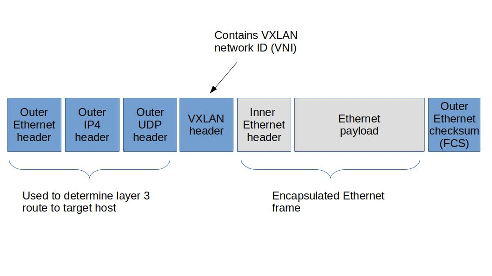

# Wormhole Project

This project tends be a toy implementation of the **VXLAN** protocol with __unknown unicast flooding__ technique using **eBPF XDP/TC**.
Please note that I am not a network engineer, and some of my assumptions about the VXLAN protocol may be incorrect. This project is not intended to be fully compliant with the VXLAN protocol; rather, it aims to create a proof of concept for an eBPF-based VXLAN VTEP and demonstrate how VXLAN & its' building blocks can be implemented using eBPF.

using eBPF we can bypass linux kernel networking stack, so it will consume less cpu cycles + it's faster.

## Technologies Used
- Golang/C
- Cilium eBPF
- bpf2go
- Containerlab + go testing + Ginkgo library
- Edge Shark
- Devcontainer + docker-in-docker


## Devoplment Prerequisites
The project has devcontainer nature, so for development, one only needs:

- Linux kernel 6.5 or newer
- Docker
- VSCode ( or any IDE with devcontainer support )


Just open up the project using vscode, and because project has a devcontainer nature (it has `.devcontainer` folder), vscode would automatically suggest you to re-open the project in a development container, proceed with that.

## e2e tests

to verify that this vxlan implementation is working correctly, we have some e2e tests. I have used `containerlab` to create a throwable testing environment.

[containerlab](https://containerlab.dev/) is kinda similar to `testcontainers` but it is more focused on networking and it has better networking abstractions, like network cables and network interfaces.

We have a topology in which there are 2 nodes, `src` and `dst` which are in the same subnet, but they are not connected to each other. in order to connect them we need to activate our **vxlan_agent VTEP** program on both border1 & border2 and check if `src` and `dst` are able to see each other or not.

the scenarios that i'm currently testing in my automated test:

1. if the VTEP software is not active in `border1` and `border2` then
    - `src` and `dst` **SHOULD NOT** be able to ping each other
2. if the VTEP software is enabled both in `border1` and `border2` then
    - `src` and `dst` **SHOULD** be able to ping each other

in the future I'll add some other scenarios to my e2e tests.


the e2e tests for vxlan are written in `./test/vxlan_agent/vxlan_agent_test.go`.<br>
the network topology used for this test is defined in `./test/vxlan_agent/vxlan_agent/clab_topologies/vxlan.clab.yml`.


to run the tests, after opening up the project in a ***devcontainer***:

1. Build the necessary images:
    ```sh
    ./scripts/build_images.sh
    ```
2. Run the tests:
    ```sh
    ./script/vxlan_agent_run_tests.sh
    ```


## Interactively testing the program via containerlab

other than performing the e2e tests, there is also another option to test the program and it's by interactively up and runing a containerlab testing lab & checking if the vxlan_agent VTEP program is actually working or not.

This topology is similar to this picture (which is used by the e2e test):


We have a topology in which there are 2 nodes, `src` and `dst` which are in the same subnet, but they are not connected to each other. in order to connect them we need to activate our **vxlan_agent VTEP** program on both border1 & border2 and check if `src` and `dst` are able to see each other or not.

to bring up this topology: (again, please do it inside the ***devcontainer*** by opening project as devcontainer in vscode)

1. Build the necessary images if not done already:
    ```sh
    ./scripts/build_images.sh
    ```
2. move into the topology directory:
    ```
    cd ./test/vxlan_agent/vxlan_agent/clab_topologies/
    ```
3. deploy the topology:
    ```
    clab deploy
    ```

when you do this it will bring up several containers:
- src
- border1
- border2
- dst

```
╭────────────────────┬────────────────────────────┬─────────┬───────────────────╮
│        Name        │         Kind/Image         │  State  │   IPv4/6 Address  │
├────────────────────┼────────────────────────────┼─────────┼───────────────────┤
│ clab-vxlan-border1 │ linux                      │ running │ 172.20.20.5       │
│                    │ wormhole/test_agent:latest │         │ 3fff:172:20:20::5 │
├────────────────────┼────────────────────────────┼─────────┼───────────────────┤
│ clab-vxlan-border2 │ linux                      │ running │ 172.20.20.2       │
│                    │ wormhole/test_agent:latest │         │ 3fff:172:20:20::2 │
├────────────────────┼────────────────────────────┼─────────┼───────────────────┤
│ clab-vxlan-dst     │ linux                      │ running │ 172.20.20.3       │
│                    │ wormhole/test_agent:latest │         │ 3fff:172:20:20::3 │
├────────────────────┼────────────────────────────┼─────────┼───────────────────┤
│ clab-vxlan-src     │ linux                      │ running │ 172.20.20.4       │
│                    │ wormhole/test_agent:latest │         │ 3fff:172:20:20::4 │
╰────────────────────┴────────────────────────────┴─────────┴───────────────────╯
```

now you need to open up several terminals

1. a terminal in vscode to open **bash** in `border1` container:
    - `docker exec -it clab-vxlan-border1 /bin/bash `
    - then in that terminal execute the `vxlan_agent` in border1 by `/build/vxlan_agent --config /build/vxlan_agent.config.yaml`
2. a terminal in vscode to open **bash** in `border2` container:
    - `docker exec -it clab-vxlan-border2 /bin/bash`
    - then in that terminal execute the `vxlan_agent` in border2 by `/build/vxlan_agent --config /build/vxlan_agent.config.yaml`
3. a terminal in vscode to open **bash** in `src` container:
    - `docker exec -it clab-vxlan-src /bin/bash`
    - then in that terminal execute the `dummy_xdp` in src by `/build/dummy_xdp --interface-name eth1`
4. a terminal in vscode to open **bash** in `dst` container:
    - `docker exec -it clab-vxlan-dst /bin/bash`
    - then in that terminal execute the `dummy_xdp` in dst by `/build/dummy_xdp --interface-name eth1`
5. another terminal in vscode to open **bash** in `src` container:
    - `docker exec -it clab-vxlan-src /bin/bash`
    - then in that terminal **ping 192.168.1.11**
6. another terminal in vscode to open **bash** in `dst` container:
    - `docker exec -it clab-vxlan-dst /bin/bash`
    - then in that terminal **ping 192.168.1.10**

in this case you can see if the **vxlan_agent** is active on border1 and border2, then src & dst can ping each other.

please don't forget to bring down the testing lab by running **`clab destroy --all`**

## Short explanation of VXLAN
In a VXLAN environment, you want several geographically remote networks to form a single (or multiple) integrated network(s). For this purpose, you need special nodes named **VTEP**.

Suppose you have two networks, A & B, which both are `192.168.1.0/24` networks, but they are geographically not in the same place and not integrated. With VXLAN, you can join `A` and `B` into one network. For this purpose, you need two VTEP nodes: one at the border of A and another one at the border of B. The connection between A and B is established through the internet (this is just an example; other scenarios may be in place). In this example, we have a VTEP node named `VTEP_A` at the border of A and another VTEP node named `VTEP_B` at the border of B. VTEP_A has several network interfaces, some of which face toward internal nodes of network A, and others face toward the internet. Similarly, VTEP_B has several network interfaces, some of which face toward internal nodes of network B, and others face toward the internet.


let's explain a simple scenario, suppose `HOST_11` **knows** the **mac address** of `HOST_21` and want to send it a **ping** request:

1. the ICMP packet will be sent from `HOST_11` to `VTEP_A/eth-in-1`
2. `VTEP_A` will check within its mac table for `HOST_21`, so it will realize which network interface it should forward the packet to.
3. before forwarding the packet it will encapsulate it within another packet with outer ethernet, outer ip, outer udp & outer vxlan headers
4. then `VTEP_A` will forward the packet through `VTEP_A/eth-ext-1` network interface toward the internet.
5. the packet will reach `VTEP_B/eth-ext-1` and will be handed over to `VTEP_B`
6. `VTEP_B` will look for `HOST_21` mac address within its mac table to find which network interface it should forward the packet to.
7. `VTEP_B` will decapsulate the packet so the outer ethernet, outer ip, outer udp & outer vxlan headers will be removed
8.  `VTEP_B` will forward the original decpasulated packet to the `HOST-21` toward `eth-in-1`


## vxlan building blocks using eBPF

to implement a basic VTEP we need to perform several functionalities:
1. packet `redirection`
2. packet `encapsulation`/`decapsulation`
4. packet `cloning` --> in case we need packet flooding ---> unknown unicast flooding
5. `mac address learning`

all of these functionalities are implemented in codes in `./internal/vxlan_agent/ebpf/c/`:
- **vxlan_xdp_internal.bpf.c**
- **vxlan_tc_internal.bpf.c**
- **vxlan_xdp_external.bpf.c**
- **vxlan_tc_external.bpf.c**


### packet redirection

in below picture a network packet reaches to an `internal` NIC of VTEP_A:

1. a packet reaches an internal network interface `eth-in-1` of `VTEP_A`
2. it will be handed over to the `XDP` program that we have already attached to this NIC
3. in the XDP program, it'll check a global eBPF map named `MAC TABLE`. it'll check if it contains any entry for the destination mac address we're trying to send the packet to. suppose we have an entry in the mac table. suppose the in the entry it has stated `eth-ext-1` as forwarding NIC
4. in my eBPF program it'll perform packet redirection to `eth-ext-1` NIC.
5. packet will be sent out from `eth-ext-1` network interface


in below picture a network packet reaches to an `external` NIC of VTEP_A:

- it is similar to previous scenario, but in reverse ( external network to internal + packet decapsulation at 4)


the packet redirection in XDP programs can be done using `bpf_redirect()` helper function

### packet encapsulation/decapsulation
suppose `HOST_11` from network A wants to send a packet to `HOST_21` in network B, this is the path it must go through: 

```
HOST_11 --> VTEP_A --> Internet --> VTEP_B --> HOST_21
```

when the packet wants to get out from VTEP_A toward VTEP_B through the **internet**, it must be **`encapsulated`** within another network packet. in an XDP program you can acheive it using `bpf_xdp_adjust_head()` helper function. it will add some headroom to the start of the packet, so one can add extra headers like outer ethernet, outer ip, outer udp & outer vxlan headers. also the same `bpf_xdp_adjust_head()` can be used to shorten the packet length and strip off the outer headers for the purpose of decapsulation when the packet is received by VTEP_B.





### packet cloning

suppose `HOST_11` want to ping `HOST_21` (192.168.1.21), but it doesn't know the mac address of it, in this case the OS (windows/linux/mac/...) of the HOST_11, will first send a broadcast ARP request to the network to ask who owns the 192.168.1.21 ip address, and what is the MAC address of the owner. in this case the VTEP_A or even VTEP_B, may have to clone this broadcast ARP request to multiple network interfaces and forward it through all of them. **in eBPF XDP program, one cannot do packet cloning** and **you can only do packet cloning in eBPF TC programs**, using `bpf_clone_redirect()` function.

### mac address learning
whenever a packet reaches a network interface with an XDP program attached to it, by looking at the source MAC address of the packet or inner packet ( in case the packet is encapsulated ) we can perform mac address learning. this can be done easily in XDP programs attached on each internal or external NIC.


## Packet Life Cycle

In this project, the packet forwarding mechanism is implemented using both XDP and TC layers of eBPF. The process is as follows:

1. **MAC Address Lookup**: When a packet arrives at the VTEP, the system first checks the MAC address table.
    - **Entry Found**: If an entry for the destination MAC address is found in the MAC table, the packet is forwarded immediately using the XDP layer. This ensures low-latency forwarding.
    - **Entry Not Found**: If no entry is found for the destination MAC address, the packet is passed from the XDP layer up to the TC layer.

2. **Unknown Unicast Flooding**: In the TC layer, the system performs unknown unicast flooding. This is necessary because the XDP layer does not support cloning a packet multiple times and redirecting it to multiple destinations. The TC layer handles this by cloning the packet and sending it to all possible destinations.


This approach leverages the strengths of both XDP and TC layers to achieve efficient and scalable packet forwarding.

So the life cycle of a packet is something similar to this:

1. **Originating Node**: The packet originates from an internal host within the network.
2. **Arrival at eBPF VXLAN VTEP**: The packet reaches the VTEP where it is processed by the eBPF XDP/TC program.
3. **MAC Table Lookup**: in XDP program attached to the VTEP we checks the MAC table to determine the appropriate forwarding NIC.
4. **Encapsulation**: The packet is encapsulated with an outer Ethernet header, outer IP header, outer UDP header, and outer VXLAN header.
5. **Transmission**: The encapsulated packet is transmitted over the network to the remote eBPF VXLAN VTEP.
6. **Ingress to Remote eBPF VXLAN VTEP**: The remote eBPF VXLAN VTEP receives the encapsulated packet.
7. **Decapsulation**: The outer headers are removed, and the original packet is extracted.
8. **Destination Node**: The decapsulated packet is forwarded to the destination host within the network.

## Types of ebpf programs needed for our VXLAN VTEP

currently we have 4 types of ebpf programs to implement a VXLAN VTEP:

- Internal XDP program  --> implemented in `vxlan_xdp_internal.bpf.c`
- Internal TC program   --> implemented in `vxlan_tc_internal.bpf.c`
- External XDP program  --> implemented in `vxlan_xdp_external.bpf.c`
- External TC program   --> implemented in `vxlan_tc_external.bpf.c`

as I previously mentioned upon each VTEP there are several NICs and some of these NICs are facing toward internal hosts of network and connected to them and some of those NICs are facing toward internet.

upon each internal NIC we attach an `Internal XDP program` and an `Internal TC program`.
upon each external NIC we attach an `External XDP program` and an `External TC program`.

Also as I mentioned previously the `TC` programs are for the sake of packet cloning & it is only used in cases that we want to clone and forward a packet to multiple network interfaces. so when we need to perform unknown unicast flooding to a packet in a XDP program, first we'll perform an XDP_PASS on that packet so this network packet will be passed up to upper layer in the networking stack in linux. TC programs higher than XDP programs in the networking stack of linux kernel. TC programs also they have more capabilities. this more capability means packet cloning. although it comes with the cost of being on slower processing path. when we handle a packet in the XDP layer we are handling it in the fast path, but when we pass the network packet up in the linux networking stack to be processed by a TC program, we are handling it an the slow pass. so unknown unicast flooding is slower than normal packet redirection happening in lower XDP layer.


## technical considerations

### Jumbo Frames ( MTU > 1500 )

Plain XDP (fragments disabled) has the limitation that every packet must fit within a single memory page (typically 4096 bytes),
but in some cases it even cannot be more than 1500 bytes, this would create problems for Jumbo frames (packets larger than 1500 bytes), 
so in this cases normal `xdp` cannot be used. Instead, a substitute XDP type named `xdp.frags` is used to handle these larger packets.

in `xdp.frags` you may have access to first page of packet payload directly, but you cannot directly access next pages of data in the payload.
as in our case we only need to access the headers of the packet so using `xdp.frags` would help us to support Jumbo frames in our system.

### MAC Table entry expiration (TTL)

Each element in the `mac_table` needs to have a 5-minute TTL (Time To Live). so after 5 minutes if a mac address is not seen, its entry in the mac table must be removed.
To implement this we use an ebpf struct name `bpf_timer`. so in each element in our mac table, we embed a bpf_timer object, and also we define a callback function
for this timer object.
after the timer for an entry in the mac table is triggered, it will trigger the callback function, in which we can remove the element from the mac table.

so whenever we see a packet in our VXLAN VTEP, we check the source mac address of that packet:
- if we currently don't have any entry for that mac address in the mac table, we will create a new entry for that mac address with a bpf_timer of 5 minutes.
- if we currently have an existing entry for that mac address in the mac table, we will reset its bpf_timer object to 5-minutes.

### Packet Size Adjustment (encapsulation/decapsulation)

When a packet from internal network reaches an internal NIC and tends to pass throught the VTEP towards the internet, we need to encapsulate this packet into another packet, containing outer Ethernet, IP, UDP, and VXLAN headers. to perform this encapsulation we first need tad add some headroom at the start of the packet.

also when a packet from outside network (internet) reaches an external NIC and tends to pass through the VTEP towards the internal network, we need to decapsulate this packet.

so for all these operations we need to be able to adjust the packet headroom. there is a helper function `bpf_xdp_adjust_head()` to modify the packet headroom in XDP programs.